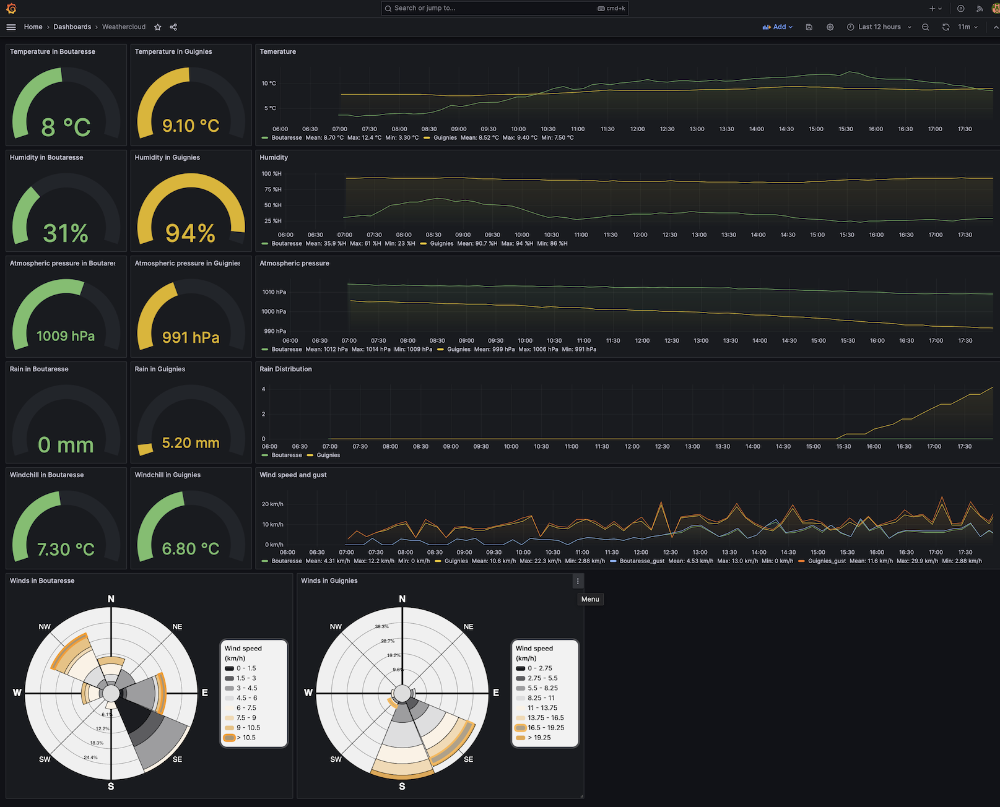

# WeathercloudScraper 

(Initially forked from [https://github.com/nimarion/WeathercloudScraper](https://github.com/nimarion/WeathercloudScraper))

This small utility regularly fetches data of one or more weather stations connected to [Weathercloud.net](https://weathercloud.net) and stores 
it in a database table. It should be run on a server or an always turned on computer. A [Raspberry Pi](https://www.raspberrypi.com/) can 
be an interesting alternative. 

The collected data can further be read to produce a variety of graphs using a frontend such as [Grafana](https://grafana.com/grafana/), as illustrated
by the following screenshot. 





## Fork specific changes
### Version 1.1
- pom.xml is adapted to generate a Java 1.8 compliant jar. This can be useful to run the scraper on an older [Raspberry Pi](https://www.raspberrypi.com/).
- The main() method now tests if another instance of the scraper is already running (avoid multiple instances).
- An index is added to the "Weather" MySQL table to improve query speed when many records are stored.
- A second Grafana JSON file is provided to illustrate a case displaying two devices. 
It also illustrates the use of the [Operato Windrose](https://grafana.com/grafana/plugins/operato-windrose-panel/) plugin for Grafana.
- This README.md file contains more explanations than the original one.
### Version 1.1.1
- Force commit insertions when database is not in "autocommit" mode.

## Compilation
You need a Java JDK (at least version 1.8) and Maven. Run:

```
mvn package
```
The "target" directory will contain a "WeathercloudScraper-xxx-shaded.jar" file, containing the scraper and all its dependencies.

Note that a precompiled jar is provided in the 'Release' section of the GitHub page.


## Configure
You must create a ".env" file somewhere on your Java CLASSPATH (or simply where WeathercloudScraper-xxx-shaded.jar is located). 
This file must contain the following entries:

```
DEVICES=3914926509 8148852804 
DATABASE_HOST=localhost
DATABASE_USER=abc
DATABASE_PASSWORD=def
DATABASE_PORT=3306
DATABASE_NAME=weathercloud
```

- DEVICES : one or more Weathercloud device ID's
- DATABASE_* : MySQL connection parameters, with your credentials.

[MySQL](https://www.mysql.com) (or [Mariadb](https://mariadb.org)) must be installed and properly configured.   

## Run
 Just run:
 
```
java -jar WeathercloudScraper-xxx-shaded.jar
```

You can obviously automatically run this at login. The way to do this depends on the OS the program is running on.


